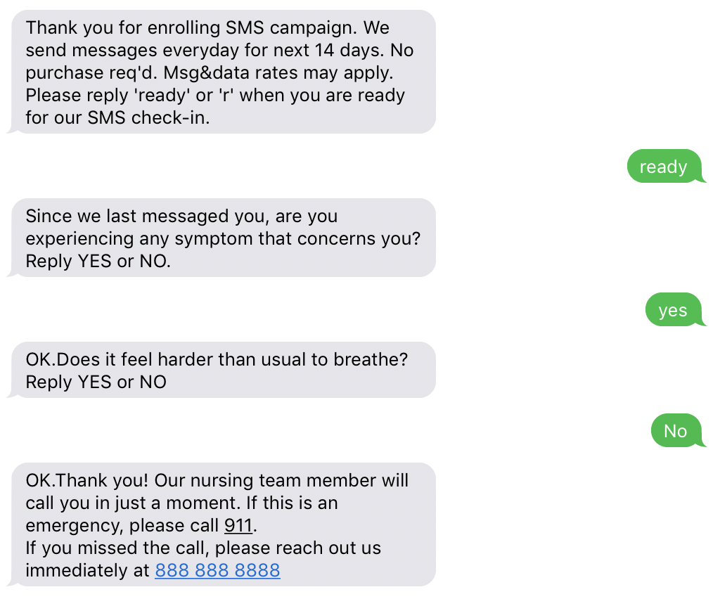

## Building Multilingual SMS Chatbot Campaign to Check-in COVID-19 Patients

See blog post for detailed discussion. 

### Architecture

The following architecture diagram demonstrated the AWS resources needed for this solution. 

The proposed solution has the following features:

1. A campaign registration portal that can send confirmation message in the user’s preferred language. The REST API can be protected by Amazon Cognito authorizer.
2. A QnA bot that responds to the transactional SMS message in the preferred language for a given phone number. QnA bot supports multiple languages.
3. An escalation outbound phone call can be initiated by the end of the clinical protocol evaluation, which can be transferred to different nursing line based on user preferred language.
4. Self-managed opt-ins and opt-outs are supported.
5. System automatically turns off campaign text messages for phone numbers according to a rolling time window, e.g. 14 days after opt-in 

### References

1. [QnA bot features and deployment guide](https://aws.amazon.com/blogs/machine-learning/creating-a-question-and-answer-bot-with-amazon-lex-and-amazon-alexa/)
2. [Self paced guide for set up Amazon Connect instance for Chatbot](https://rise.articulate.com/share/MhzJNhlCBWc6ptgK4As_ZQ9HlbAnEPs_#/lessons/gYp533WHnrvJTYCrDBVvhaVXJXUcd0gA)

## License

This library is licensed under the MIT-0 License. See the LICENSE file.

